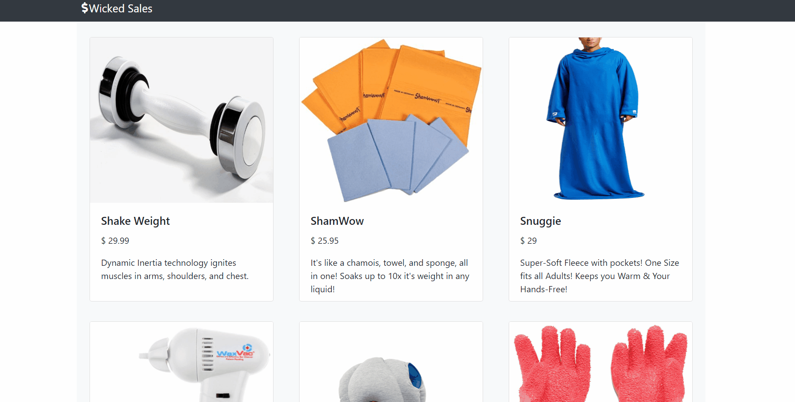

# wicked-sales-js
> - Maintained by: `loganmulvihill`

## Description
A Full Stack Node.js and React shopping cart app.

## Live Demo
Coming Soon!

## Technologies Used
 - HTML
 - CSS
 - React.js
 - JavaScript (ES6)
 - Node.js
 - Express
 - PostgreSQL
 - Bootstrap
 - Yelp Fusion API
   -- https://www.yelp.com/developers/documentation/v3/get_started

## Features
1. User can view product list.
2. User can view individual product details.
3. User can add items to cart.

## Preview
 
